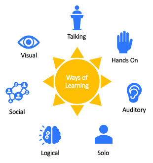

# Ways of Learning
I had plans for this post to be technical; then had a little revelation. What if others are following me on this journey, but don't learn enough from my writings? Perhaps I'm rambling, or not communicating clearly. What if, you find items interesting, but want to do a deeper dive? What if, you learn and retain information in a different method.

It's a contentions topic, *Ways of Learning*. It's can be a mess of conflicting opinions. Some backed by science, others not. From the little research I've done, it seems to me that there are 7 ways of learning. Each of these ways manifests information in a slightly different way. I've taken a moment to piece together, how you could get this information, in addition to these writings. Hopefully this will helps you, and you get the most out of this series.

The seven ways as I see it are:

1. Visual

    You learn by watching and seeing visual representations. If this is you, Youtube, and the MS learn videos are for you.

2. Aural

    You learn by listening. You can use the resources above, as well as audio books, or Podcasts (My favourite)

3. Verbal

    You learn by speaking or writing about the topic. This could be public speaking, blogs **cough cough**, or other writings.

4. Physical

    If you're physical learner, you learn by doing. Best to get a demo tenancy fired up and make the bits byte.

5. Logical

    If you're a logical thinker, you need a problem to solve. You like to research the resolution. You read, listen, watch or talk about the items until you know how to fix. I'd suggest you pick a real world problem, or follow along 

6. Social

    Learn the most when you talk with peers about something? Great, fire up the comments, email this around, or talk with colleagues about something cool.

7. Solitary

    Prefer to research and then internally reflect. Then you're probably a solitary learner. 

# Resources

Knowing now about the different methods of learning, you mind find that the following resource align more closely to your way of working. Recommend something that's missing? If you're confident with Git, shoot me a PR. Not so Git-Tastic, that's fine, add your suggestions in the comments!

## Videos

* [John Savill's Technical Training - Youtube](https://www.youtube.com/c/NTFAQGuy)
* [Microsoft Shows](https://docs.microsoft.com/en-us/shows/browse?products=azure) - RIP the Channel9 show
* [Microsoft Azure Youtube Channel](https://www.youtube.com/c/MicrosoftAzure)

## Podcasts

* [The Microsoft Cloud Show](http://www.microsoftcloudshow.com/podcast)
* [MS Cloud IT Pro Podcast](https://www.msclouditpropodcast.com/podcast-episode/)
* [Azure Fridays](https://docs.microsoft.com/en-au/shows/azure-friday/)

## Documents

* [Azure Documentation Centre](https://docs.microsoft.com/en-AU/azure/?product=popular)
* [Microsoft Learn Centre](https://docs.microsoft.com/en-us/learn/browse/?products=azure&resource_type=learning%20path) - You'll want to pick a learning path

> Tip: Check back here regularly, this list WILL be updating.

# Wrapping it up

Now that the distraction is over, the next post will get stuck into technical concepts. You now know why I'm doing this, and also how you can get the most from it.

>Day 2 of 💯. Noicely Noicely

98 (minus weekends) to go 💪

