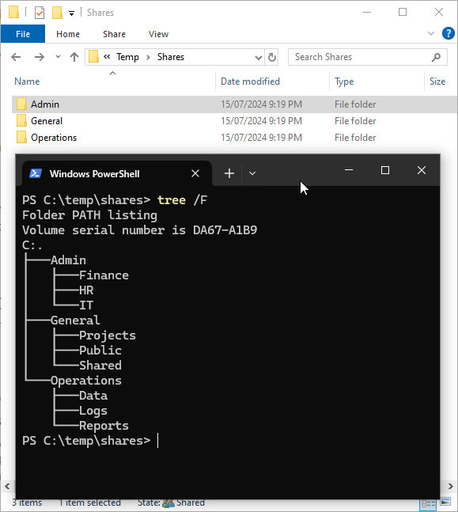

In many organisations, data permissions have historically been managed on file servers, through the folders contained on shares. SharePoint Online challenges the typical ways of thinking around permissions, specifically where you draw the permission boundaries. When completing permissions on a file server, it typically involved creating folders on a file server and setting user permissions, hopefully via security groups, on these folders. Over time, as organisations grow and evolve, permission boundaries can become increasingly complex, with permissions nested multiple folders deep. This complexity can lead to significant concerns, both from a permission landscape and also a migration pathway.

One of the major issues with this traditional approach is the potential for over-permissions. As file systems evolve and more users need access to various documents, permissions can become overly permissive, granting users access to data they don't necessarily need, or worse yet, adding users to groups to provide permission to a folder, that provides much more access than intended. This not only poses a security risk but also makes managing permissions a daunting task for IT departments.

  

SharePoint migrations can help with this. Adopting and migrating to a modern SharePoint solution provides an opportunity to re-evaluate and streamline your organisation's permissioning strategy. SharePoint allows for the creation of clear, hierarchical permission boundaries that make sense for your organisation’s structure at a site level. This ensures that users have access only to the data they need, enhancing both security and manageability.

In future posts, we will delve into how to set up these permission boundaries in SharePoint. What you need to understand for the moment is how different permissions can be, through the hub and spoke site setup. For now, let's focus on understanding the legacy file system and how permissions have traditionally been managed.

## Legacy File System Permissions

Traditionally, permissions in a legacy file system are managed through NTFS ACLs (Access Control Lists) on folders and files. While permissions can also be set at the share level, it is less granular and in reality rarely used. Here’s a typical scenario:

- **Folders on a File Server**: Files and folders are created on a central file server. These folders are often organised by department, project, or function.
  
  

- **File Share**: These files and folders are then shared using sharing utility. It's typical to see the permissions set to All Users full access.

- **NTFS ACLs**: These are used to specify which users or groups can access specific files and folders, and what level of access they have (e.g., read, write, modify). This can create complex permission boundaries that are difficult to manage.

  

- **Nested Permissions**: Over time, as more folders are created and more users need access, permissions can become nested multiple levels deep. For example, a user might need access to a subfolder within a department folder, which in turn is nested within a higher-level folder.

  

## The Problem with Over-Permissions

As organisations evolve, the risk of over-permissions increases. Here are a few common issues:

- **Security Risks**: Users may have access to sensitive data that they don't need, increasing the risk of data breaches or leaks.
- **Regulatory Compliance**: Many industries have strict regulatory requirements for data access and security. Over-permissive access can lead to non-compliance, resulting in legal and financial penalties.
- **Management Complexity**: IT departments have to spend significant time managing and auditing permissions to ensure they are appropriate.
- **Lack of Clarity**: It can be difficult for users and administrators to understand who has access to what data, leading to confusion and potential mistakes.

## Moving to SharePoint: A Fresh Start

SharePoint offers a fresh start for organisations looking to streamline their permissions. By re-evaluating the permissions required by all users, organisations can set up clear, hierarchical permission boundaries that make sense. This not only enhances security but also simplifies the management of permissions.

In future posts, we will explore the specific steps to set up these permissions in SharePoint. Stay tuned to learn how to make the most of SharePoint's robust permissioning capabilities.

## Comparison: Legacy File Systems vs SharePoint

To better understand the differences, let's compare some key aspects of legacy file systems and SharePoint permissions:

| Aspect                    | Legacy File Systems                       | SharePoint                             |
|---------------------------|-------------------------------------------|----------------------------------------|
| **Permission Structure**  | Nested folders                            | Sites and hubs                         |
| **Access Provisioning**   | Manual and often overly permissive        | Granular and role-based                |
| **Auditing Capabilities** | Limited                                   | Extensive auditing and reporting       |
| **Sharing**               | Requires manual provisioning              | Easy sharing with links and permissions|
| **Over-Permission**       | Common due to complexity and evolution    | Minimized with clear boundaries        |
| **Granular File Access**  | Over provision access to entire folder(s) | Leverage sharing links with expiry   |

## Conclusion

By rethinking your approach to permissions and leveraging SharePoint's capabilities, your organisation can ensure a more secure and manageable environment for your data. This all whilst adopting the modern technology offerings of SharePoint. But before getting started with any migration, it's important to accept the current starting point.

Ready to make the switch? Follow along with our upcoming posts to get started.

---

For more information or to discuss your specific needs, feel free to reach out to me on [LinkedIn](https://linkedin.com/in/smart-tom)