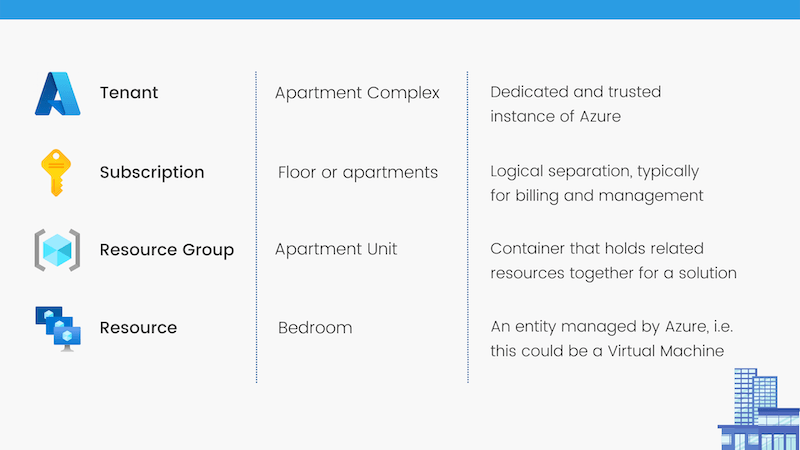

# The layers of Azure

Like Ogres and Onions, Azure has layers. These present themselves through:

* Azure Tenancies
* Management Groups
* Subscriptions
* Resource Groups
* Resources

Each of these layers has its own constructs, provides value as either management, grouping, billing or a combination of above (Excluding resources which are the item being managed). How best to initially describe these layers? I often use the analogy of an Apartment Complex.

## Azure Tenancy

The Azure tenant is the building complex hosting the apartments. It provides all the essential plumbing (read authentication) for residents to use. The tenant is actually an instance of Azure AD, allowing you to create identities with varying roles or access. 

Microsoft leverages Azure AD for a number of their hosted application, including Microsoft 365. Many organisations will have an Azure tenant via this mechanism. The tenant may also exist from signing up to an Azure trial or subscription.

Tenancies don't always have azure subscriptions. Subscriptions always have a tenant.

## Subscriptions

Subscriptions are the floor that the apartment is located on. There can be many apartments located on on floor, the same way that there can be many resource groups and resources located within a tenant.

Subscriptions consist of many purposes, including:

1. **Payment Agreement** - Each subscription has its own payment mechanism. That could be through a CSP, Enterprise Agreement, Invoice, Credit Card, etc.
2. **Administrative Container** - A subscription can be used as a logical container for administrative functions. You can define RBAC, Policy and security measures that apply to the entire subscription.
3. **Scale Limits** - You can use subscriptions to escape scale limits. If you are exceeding the service limits for a technology, you may span that technology across numerous subscriptions.
4. **Legal Agreement** - The subscription encapsulates the [azure offer](https://azure.microsoft.com/en-au/support/legal/offer-details/) as well as the Azure legal agreements.

Subscriptions are also global, they are not tied to a region.

## Resource Groups
Resource groups are the apartment. They contain all the rooms and items that make an inhabitable space. Resource groups are used to logically contain related resources together. Resource groups should be used to include all resources of a solution, or those you'd manage as a single group. As these resources within the group are all related, their lifecycle often overlaps, you can perform some bulk operation, such as deletion, on all items within the resource group.

Resource groups are also responsible for the management of resource metadata. This may influence what region you create the resource group in.

Useful tools within Resource Groups are:

* **Tagging**  - Create flexible meta data, that can be enforced through policy. You could have a tag that defines the responsible owner, the cost center to rebilling or the status of project.
* **Locking** - Locking allows you to restrict editing and deletion of critical resources.
* **Role Based Access Control (RBAC)** - Present access to individual solutions, rather than the entire subscription.
* **Billing** - Using the cost explorer, you can break down costs by resource groups.

## Resources

Resources are the rooms in the apartment. They are the reason that all the layers of the cake exist. The bedroom provides a place to sleep, the kichen a place to cook, the lounge a place to relax. Similarly resources are azure managed items, A virtual machine, a storage account with blob data, a service bus piping many technologies together.

Microsoft are constantly expanding service offerings, these resources are no longer Virtual Machines and Data storage. Resources are defined as services Azure Resource Manager (ARM), this means that resources expand from AI models, to onpremise servers

Be careful the placement of resources when they are created. Whilst tooling is constantly improving, and a large number of items can be moved between resource groups and subscriptions, they can sometime require downtime, or data migrations. [Moving resources](https://docs.microsoft.com/en-us/azure/azure-resource-manager/management/move-resource-group-and-subscription)

# Example

An organisation is building a new, cloud native project, to address a unique business problem. No existing market offerings exist and the organisation has decided to develop their own internal program.

The project will be billed separately, as it is being financed by the business unit sponsoring the work. There will are 2 main technical solutions within project, each with their own access requirements.

There are many ways that this could be achieved, one method would be:

| Subscription | A new subscription, with a new billing method setup by the business unit |
| Management Group | Not necessary at this scale |
| Resource Group | 2 Resource groups, allowing for RBAC for the 2 solutions |
| Resources | All required resources within the 2 aforementioned groups |

# Additional Resources

| Style | Link |
| --- | --- |
| Visual Learner (John Savill's Youtube Channel)| [Exploring the Real Relationship Between Azure AD and Azure Subscriptions](https://www.youtube.com/watch?v=sXurr46f3HA)
| Auditory Learner | I don't have anything for this one here yet.|
| Physical Learner | [Sign up for Azure tenant](https://azure.microsoft.com/en-us/free/), create a subscription, create a resource, play with the resource group. |
| Solitary Learner | [Read the microsoft learn module](https://docs.microsoft.com/en-us/learn/modules/azure-architecture-fundamentals/overview?ns-enrollment-type=learningpath&ns-enrollment-id=learn.az-900-describe-cloud-concepts)

##### fin

>Day 4 of 💯. Subscribe to this resource: [RSS Feed Here](http://localhost:4000/feed.xml).

96 (minus weekends and apparently holidays) to go 💪

