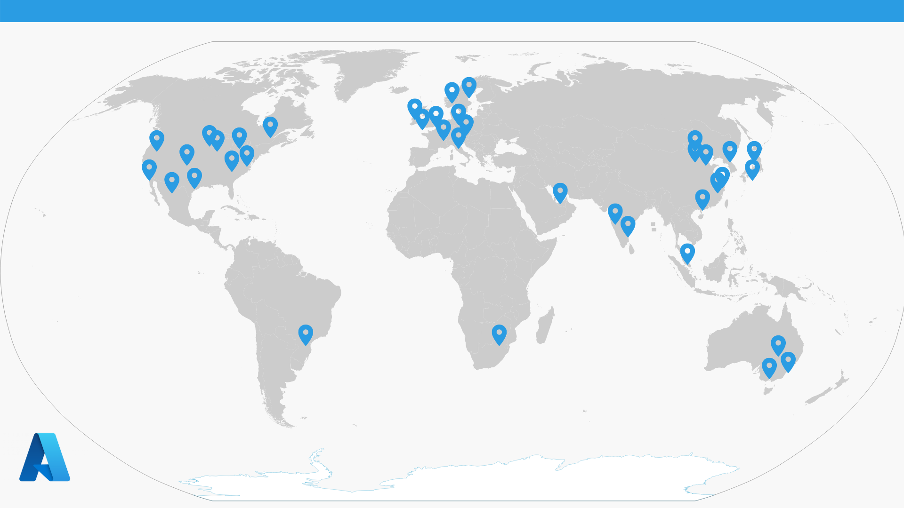
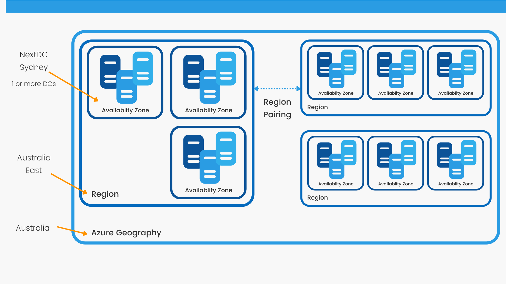

# Where in the world!
Before getting stuck into this post, if you're reading this after April 22, it's probably now out of date. Azure's footprint is constantly expanding and being innovated upon.

Best to read the Microsoft documentation, or check out the [interactive global infrastructure map](https://infrastructuremap.microsoft.com/explore)

Microsoft's global azure reach is impressive. Microsoft boast that it has more global regions than any other cloud provider. The footprint is constantly evolving as the technologies are being aggressively adopted. What is also interesting is the exploration into other ways of providing these data centre's. A favorite, and easy conversation starter, is their experiments into [underwater data centres](https://news.microsoft.com/innovation-stories/project-natick-underwater-datacenter/)

## Availability Zone

Within an Azure region are availability zones. Each availability zone, sometimes referred to as AZ's, is made up of one or more data centers that are powered, cooled, and networked independently. This is important as these az's serve as an isolation boundary. If one zone fails, the other continues to function. High-speed, private fiber-optic networks connect the availability zones, this allows for most applications to access near real-time replication.

By co-locating your computing, storage, networking, and data resources inside a zone and replicating into other zones, availability zones can be used to operate mission-critical applications and embed high-availability into your application architecture. However, duplicating your services and transmitting data between zones may come at a cost.

## Azure Regions

What's a region? Simply, a geographically close collection of three availability zones. There are governing items that define a region, including a latency of less than 2ms between DCs as well as physical distance. It's worthwhile noting that not all regions offer all services. As regions grow, and scale out, services are enabled. These regions allow apps and infrastructure to have a global or local presence as required.

When you deploy a resource, you'll frequently be asked to choose the region in which you want the resource to be provisioned. You maybe asked to define redundancy, which I'll cover off in another post, and this is where it's important to understand these differences.

### Special Regions

Azure has specialised regions that you might want to use when you build out your applications for compliance or legal purposes. A few examples include:

* **US DoD Central, US Gov Virginia, US Gov Iowa and more**: These regions are physical and logical network-isolated instances of Azure for U.S. government agencies and partners. These data centers are operated by screened U.S. personnel and include additional compliance certifications.
* **China East, China North, and more**: These regions are available through a unique partnership between Microsoft and 21Vianet, whereby Microsoft doesn't directly maintain the data centers.

## Region Pairs

One or more data centers are used to create availability zones. Within a single region, there's at least three zones. A massive natural disaster could cause an outage large enough to affect perhaps two data centers. This is why Azure also creates region pairs.

Each Azure region will always be matched with another region with the same geography (such as the Australia, United States, Europe, or Asia) which is at least 500 kilometres away. This strategy enables for the replication of resources (such as VM storage) across a geography, which helps minimise the likelihood of interruptions caused by events such as natural disasters, civil unrest, power outages, or physical network outages that strike both locations at the same time. If one of the regions in a pair was hit by a natural disaster, for example, services would instantly failover to the other area in the pair.

You may use the pair of areas to provide reliable services and data redundancy because they are directly connected and far enough apart to be isolated from regional catastrophes. Using region pairings, several services provide automatic geo-redundant storage.

Also, If there is a widespread Azure outage, one region from each pair is prioritised to ensure that at least one region is restored as soon as practicable for applications hosted in that region pair. Microsoft also use the region pairs to minimise downtime and the possibility of application outages, planned Azure changes are rolled out to paired regions one area at a time.

# Additional Resources

| Style | Link |
| --- | --- |
| Visual Learner | [John Savill - Understanding Microsoft Azure Availability Zones!](https://www.youtube.com/watch?v=4nDRvZR2EjU) |
| Auditory Learner | I don't have anything for this one here yet.|
| Physical Learner | [Play around with storage accounts](https://microsoftlearning.github.io/AZ-900T0x-MicrosoftAzureFundamentals/Instructions/Walkthroughs/05-Create%20Blob%20storage.html) |
| Solitary Learner | [Read the microsoft learn module](https://docs.microsoft.com/en-us/learn/modules/azure-architecture-fundamentals/regions-availability-zones)

>Day 5 of 💯. Lost in space!

95 (minus weekends) to go 💪

