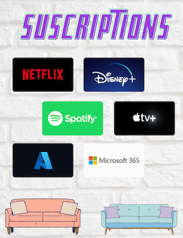
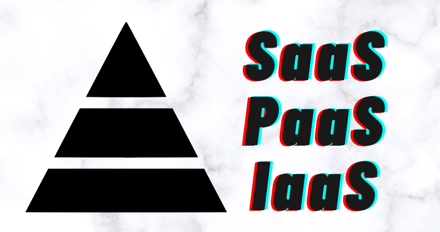

# Subscription's are king

It's been a fundamental shift that's occurred over the recent decades. Gone are the days of paying once for something, now we're offered the opportunity to continually pay for things that we once owned outright. Sure, it's not without benefits, but rarely do you now 'own' a software license or 'buy' a server.

Why the change to a renter's market? There's a few reason's it's occurred:

* Low, or no, initial CapEx
* Predicable bills, based on consumption
* Economies of scale for technology enablement
* Shared responsibility, those best placed to manage the items are the ones tasked with the job.
* New features are often included. The vendor can afford a development team to work on the product with their own predictable income.
* Maintenance is often included, see above point.
* The pricing can often be per user or per seat based. This can make it more competitive for the smaller and medium businesses. Large and Enterprise have the buying power of negotiation still.
* Products can be split into multiple tiers or add-ons. Rather than having to pay for the entire product, you can software unlock additional features.

Aside from the market jargon, there is a wealth of technical features that can be unlocked. Teams can gain access to technology that was either beyond the capacity to setup and manager, or just plain too expensive.

Example, few organisation ran Skype for Business. Evolving from UCS -> Lync -> Skype for business the product team worked for years to try and land the technology into their customers premises, but it was too expensive. The servers required to run it were too complex and numerous, and the skill set required to administer and build sparse. The integration was there, the functionality was there, the marketing was there but it just never stuck.

Microsoft launched Teams (SaaS) and it has evolved to become on their best success stories. Recent information shows that they are at 230 million daily active users. 90% of the Fortune 500 have adopted it. During the COVID-19 pandemic, its growth has been rumoured to have caused availability constraints within Azure as the product was expanding quicker than hardware could be procured. Why? It cost nothing for existing subscriptions. Add-on's were available to unlock greater functionality, setup was simple.

# What in the aaS?
Confusion sets in as the subscription model marketing takes flight. In an attempt to make the offering more understandable, a catchy phrase was needed. Software-as-a-Service (SaaS) initially paved the way. Rather than running databases, scoping sizing requirements and hosting application servers, why not leave all that hard work to the vendor? They run all the infrastructure that's required to make run the app. Not only just the infrastructure, they are responsible for the entire stack. The customer responsibility was often limited to access, and data. You need to define who has access to what, and the data is stored in the correct location, and treated in alignment with organisational policy.

Great Success. We have take off. 🛫 Accountants initially gripe at the loss their standard Capex accounting methods, but the bill predictability and scalability take hold. Now what? Seeing the success of SaaS, vendors starting coining the idea, and extending the product offerings.

Infrastructure-as-a-Service, IaaS, was the next cab off the rank. Rather than buy expensive server hardware, arrange a secure and reliable data centre and manage hardware failures and warranties, IaaS was the answer! Vendors everywhere started to offer Virtual Machines that you could purchase. Pick a size, design a network, and away you go. Want backups? No problem we've got an add-on for that. Want replication, again - no problems, we've got an add-on. Sys Admins rejoice, as disk failures and capacity management become a battle scar of your IT career. A simple project no longer became the catalyst for a hardware refresh or procurement exercise. IaaS isn't as easy going as SaaS however. It's still on you to keep the OS/Apps up-to-date, ensure that the system is working well.

Seeing that these items are at different ends of a scale, its easy to understand why Platform-as-a-Service was derived. PaaS really unlocks organisation to focus on what they are good at, whilst still having the flexibility to run what they need. Need an SQL database, most businesses do - few business have a full time DBA though. Perhaps that database is relatively small, but still critical infrastructure. Suddenly an SQL farm, in multiple geo locations, and other requirements mean that this tiny DB is now costing thousands of dollars. PaaS allows you to have the flexibility to use consumption based pricing, and choose those items important to you. Because the vendor needs to setup the platform to cater to a wide range of scenarios, and the fact it will likely multitenant solution, they are able to unlock complex architecture for a fraction of the price. This flexibility is a testament to the economics of scale.

# The shared responsibility model
Microsoft have already written well about the responsibility by stakeholder against different as a service offerings. [Its a short read, but will really empower your understanding of who is responsible when](https://docs.microsoft.com/en-us/azure/security/fundamentals/shared-responsibility)

# Simple Please

| Acronym | Actual Model | Description | Example |
| ---- | ---- | ---- | ---- |
| SaaS | Software as a Service | Software that you purchase in an ongoing manner, most items are managed by the vendor | Office365, Sales Force, etc |
| PaaS | Platform as a Service | Key components that you can consume, interact or program with. You're not responsible for the management/maintenance of the platform/os, but the app that it may interact with | Azure SQL, Azure Functions | 
| IaaS | Infrastructure as a Service | Low level components, storage, computer, networks. You don't worry about hardware, but that's about it. | Azure Virtual Machines | 

# Where to from here?
There's no doubt that more layers of cake will be added. The as-a-service model will undoubtedly, and is, expanding. Desktop-As-A-Service (DaaS) is already taking hold with the likes of Azure Virtual Desktop and W365 Cloud PC. Some service offerings will be a flash in the pan, but there's the chance the next revolution is around the corner. Best to keep the eyes and mind open. 

>Day 3 of 💯. Blog-As-A-Service.

97 (minus weekends) to go 💪

