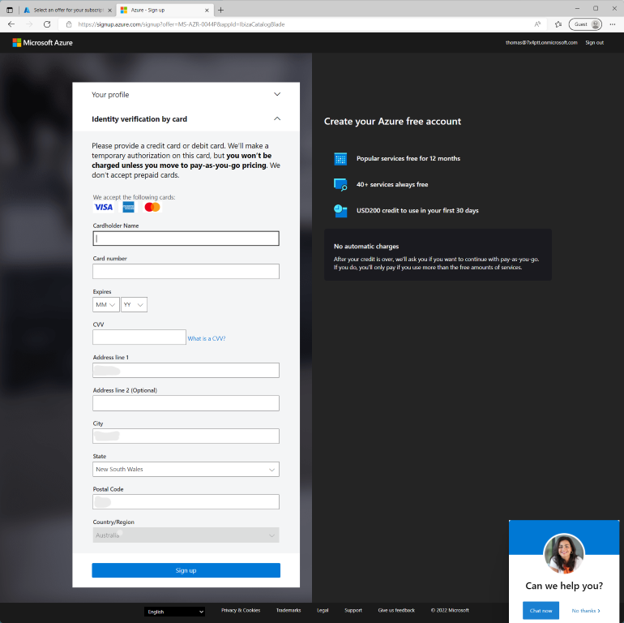

# Lets get down to business!
Alright! Enough with the talking. Let's get into it. This blog post we will cover the starting blocks of leaping into a world of exploration and *labbing*. We will _actually_ create a tenant that we can use throughout our Azure explorations.

You may think that this is the start of one of the smallest possible blog posts. Sign up, done? And it honestly could be, but stealing from our news friends, we've got some great click bait!

## 9 out of 10 IT professionals don't know that this method exists

## You won't believe this free licensing available from Microsoft 🤯

Ok Tom, you've got my attention. what's this all about? It's no secret, and in fact you should probably already know, Azure AD is the identity backbone to the ever popular SaaS Microsoft365. AzureAD is also the 'tenant' component of Azure. In creating an M365 subscription or tenant, you are also creating the AzureAD tenant which can also be the basis for you leverage Azure.

**Mmmkay, so, why for all the click bait about this?**

> ⚠️⚠️This process is not for production. It's a cheeky method of gaining access to more resources for free ⚠️⚠️

Before you go much further down this post, please understand that I am not suggesting you use this at work, for sandboxes. I'm envisioning that you are reading this so that you can better your own skills, for your own benefit, during your own time.

Well Microsoft have a dedicated developer program for M365. This developer program is intended for those developing software, processes and other systems that integrate with M365. The M365 developer program offers three key benefits:

* A M365 E5 license. This E5 license includes a multitude of M365 components, including items such as AzureAD plan 2
* Demo content. This includes demo users
* A separate entity from your employee's tenant.

What's the catch? You have to use it at least once every ninety days. If no activity is detected for ninety days, you will get an email. No response or action to that email? The licensing is removed, and you're tenant is destined for the trash.

# I'm keen, let's go!

1. Go to the [M365 developer program page](https://developer.microsoft.com/en-us/microsoft-365/dev-program)

2. Sign in with your MSA account. 
3. Fill in your name, a company and other requirements

4. Select personal projects (or different if more relevant to you)
5. Select 'Microsoft Identity Platform'
6. Save
7. You'll now be prompted to pick either an empty or populated sandbox

    I went with the full sandbox experience. This will allow me to get some actual results later in the series when we start to interrogate the GraphAPI and use logic apps
8. You'll now need to enter you're tenant details. Including region, admin username and password.
9. Give them your phone number, for 'security'. Confirm with code. Naturally.

    Bada bing Bada boom. You'll have a tenancy!
10. Click go to subscription and enter your password when prompted

So you've not got an tenant, through the M365 developer program. This is most excellent. But not what we fully intended. We now need to go and sign up for an Azure subscription in the new tenant.

1. Once signed in, navigate to [portal.azure.com](https://portal.azure.com)

2. Head over to subscriptions. This pane will be empty. Let's fix it!

3. Click 'Add Trial'. This will give us all the standard benefit, as though we had just signed up to a new account ($200 credit and 25 free services for a year.)
4. Fill in the profile. You'll be prompted for Name, address and mobile number. Again, for 'security'
5. Prove your identity via credit card. They will no use this as a payment mechanism. It's only used to stop people continually signing up for free credits.

6. Once you've done this, the offer will be added to your tenant through a new subscription. Great success!

Where to from here? Only up!

>Day 7 of 💯. Continuity isn't a thing, right?

93 (minus weekends) to go 💪

