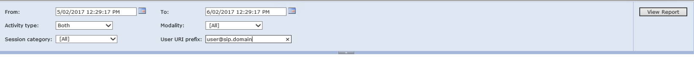
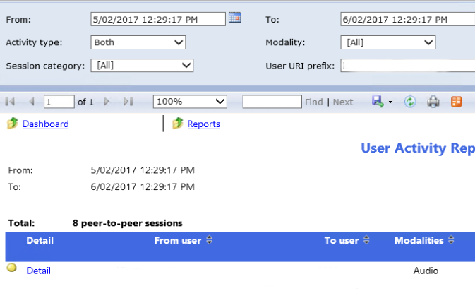
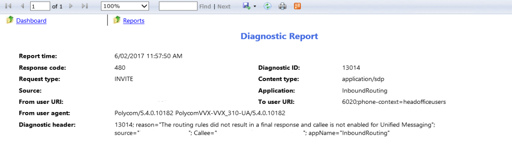

Recently, I encountered a weird issue where an extension could call outbound, but didn't receive any incoming calls. Callers would hear the busy tone, and if exchange um hadn't been configured, disconnected.

Comparing the CS-User to a known working extension showed no differences and there were no extension conflicts.

If you are having this issue, I'd recommend the following

1. Open the report server
2. Click the user activity report
3. Search for the user you completed the testing from 
4. Find the call  
5. Open the details of the call, then open the details for the diagnostics of the call

In my instance, I had the error message


The routing rules did not result in a final response and callee is not enabled for Unified Messaging


[Greig from greiginsydney has seen this before and reports that it is caused by bad firmware adding an incorrect call forward rule.](https://greiginsydney.com/polycom-vvx-gives-sip480-cant-be-called/) Following Greig's steps and re-creating the AD account and Lync account resolved the issue.
Also, [Greigs blog](https://greiginsydney.com) is beyond wizardy and you should definately check it out.
