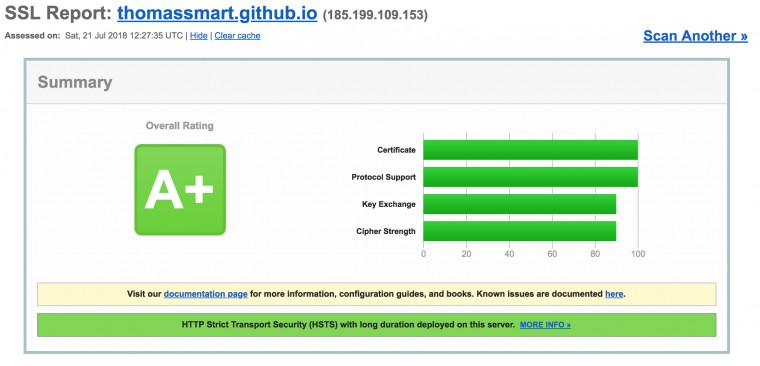
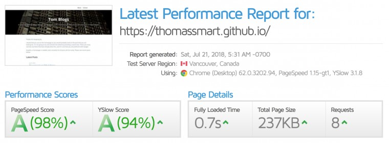

I've been recently been working on S2D and have been working on edge cases that have no online documentation. Wanting to share this knowledge I knew I had to have another crack at blogging. Thinking on how to make it work this time, I knew that the blog would have to be:

* Free - Given the low readership, I don't want to pay anything toward it
* Easy to use/update
* Secure
* Fast
* RSS Feed

Given all these criteria, I was aiming for a Jekyll based blog, hosted by GitHub pages. Jekyll creates static webpages using mark down. This makes it simple to use, fast as the content is static and secure as there is no 'admin' interface. GitHub pages is free, fast and secure.

Its all up and running now, it took a couple of hours. But I'm really happy with the result.

Keep posted for more blogs coming up!

