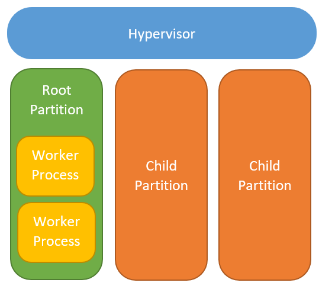
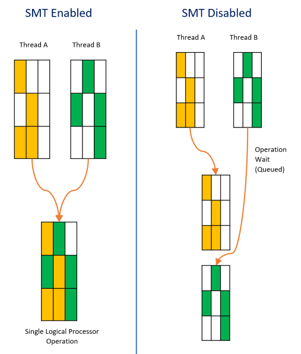
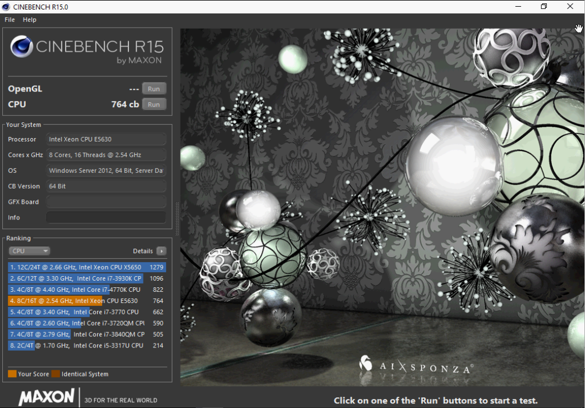
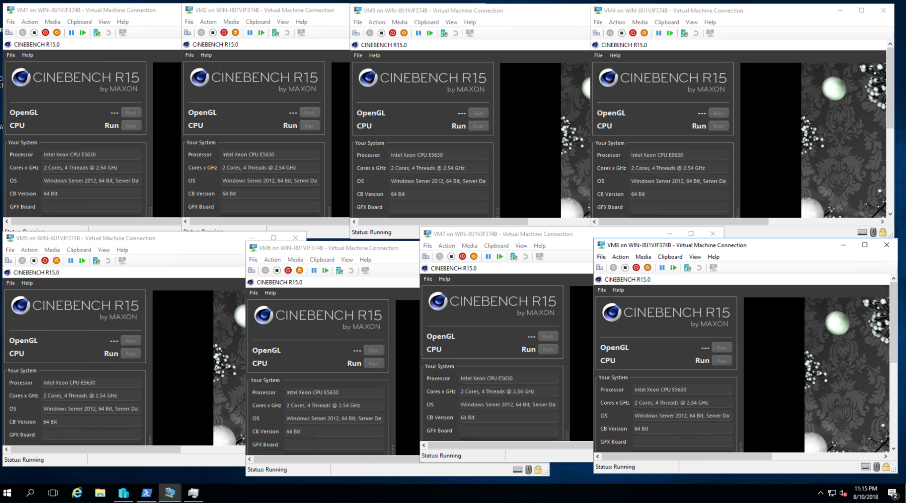
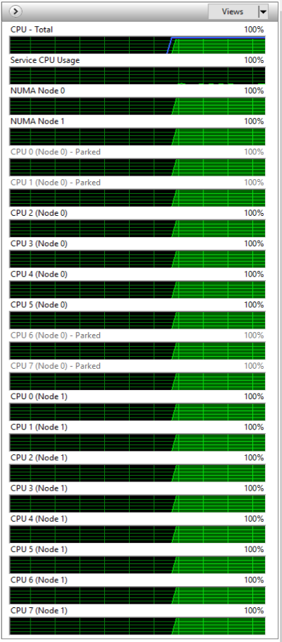
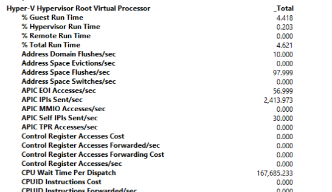
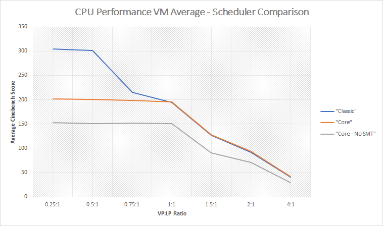
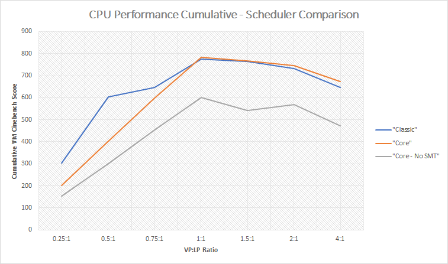
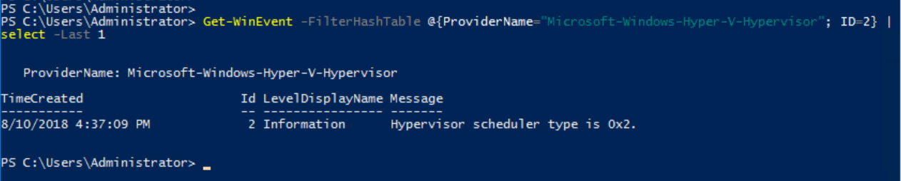
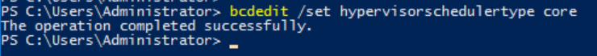

Recent security vulnerabilities within CPU's has resulted in a need to change some fundamental CPU scheduling within Hyper-V, so to keep VM's secure. [Microsoft has an article outlining the different schedulers, that now available](https://docs.microsoft.com/en-us/windows-server/virtualization/hyper-v/manage/manage-hyper-v-scheduler-types). This blog article is to help with understanding the schedulers, how they work and perform, as well briefly explaining how Hyper-V virtualises CPU resources. To begin, we need to understand partitions.

# Partitions

When the Hyper-V role is enabled, the way that Windows Kernel handles CPU operations changes significantly. Workloads are separated into 'Partitions' and the CPU operations within these partitions are sent to the hypervisor scheduler. Partitioning allows to keep each VM within their own container, excluding them from being aware of each other. When a VM is powered on, the hypervisor creates a child partition, for that VM. The Hyper-V host is created a root partition by the hypervisor at OS boot.

This is best described in the image below

The Hyper-V Host root partition is in fact a VM! It is worth mentioning, that this root partition has significantly more privileges than that of a standard VM. The root partition  also orchestrates management of VM (Through the VM worker processes and VM Management Service). Partitions are managed by the hypervisor. The hypervisor shares the hardware resources with each partition. The CPU hardware is shared through the CPU scheduler.

# CPU Scheduler

The CPU scheduler takes the CPU operations from the partition's CPU Virtual Processors (VP's) and distributes them to the host's physical logical processors (LP's). The scheduler resides within the hypervisor level in the above image.

Up until now there has only been a single, 'fair share' scheduler. The fair share scheduler has served us well for many years, with its round robing sharing mechanism. Unfortunately the scheduler relies on assuming that each of the host's LP are completely isolated from each other LP.

Simultaneous multithreading (SMT), which is also known as Hyper-Threading in Intel World, allows processors to parallelise operations from multiple threads, this results in a an increase in performance.

 In recent times SMT has suffered from some serious security vulnerabilities that no longer allows us to assume that data is protected within the processor. Some of the most notable recent vulnerabilities are:

 * [Intel L1 Terminal Fault (L1TF)](https://www.intel.com/content/www/us/en/architecture-and-technology/l1tf.html)
 * [Meltdown and Spectre](https://meltdownattack.com/) - Which affects many vendors, Intel and AMD included.

These vulnerabilities mean that applications could steal information that is flowing through the CPU. Whilst this is alarming, the seriousness is greatly heightened when you consider virtualisation. Under Hyper-V using the 'classic fair share' scheduler, theoretically, its possible for this to occur between completely isolated VM's. At this time, this isn't  a documented exploit for virtualized workload attacks.

Microsoft has worked with vendors to resolve these issues. Numerous Windows Updates, often containing CPU microcode, attempting to resolve the critical vulnerabilities have been released. Regardless of if these issues are 100% resolved, we can no longer assume that the CPU is secure enough to handle workloads when virtualising.

Microsoft, recognising this,  has created new CPU schedulers. These new CPU hypervisor schedulers are available within Update 2018.07 C on Server 2016, Server 2019 and Windows 10...

The new schedulers are:

* 'Classic'  - Traditional round robin scheduler that we all know
* 'Core'     - Offers stronger boundaries through the constraining of VP's to LP's. Constraining the VP's mean that they are only only workload on the LP at that time.
* 'Root'      - Default in, and only recommended for, Windows 10. The scheduling is handled by the root partition, rather than the hypervisor. This allows for windows

| CPU Scheduler Type | Performance | Security |
| ----- | ----- | ----- |
| 'Classic' | Good, allows for generous over-subscription and performance  | Low - SMT is utilised and though workloads are in separated partitions, the partition VP's can run parallelized on LP's. This could result in one partition being privvy to the operations of a different partition |
| Core Scheduler - Host SMT Enabled | Reduced compared to Classic when under a 1:1 ratio, due to VP's being bound to LPs. SMT is exposed to the VM. Once overcommitted the performance degrades at the same rate as Classic. | Security is improved as child partitions VP's are isolated for all other partitions VP's and are assigned to LP's for operations. |
| Core Scheduler - Host SMT Disabled | Similar performance to Core Scheduler - Host SMT Enabled, however the number of LP's is halved | Stronger again as operations within the child partition can't leak across VP's within the same partition |
| Root Scheduler | I didn't benchmark this, however my understanding is that it would be lower than that of either core or classic. This is due to the overhead of it flowing through Root Partition. | Child partitions are exposed to the root partition,  workload can be analysed by Windows Defender Application Guard, so your call on this one. |

# Performance Testings
Test bench - HPE DL380 G7 (Old, but available)
* 2 x Intel Xeon E5630 - 2.53 Ghz.
  * Quad core
  * Hyperthreading capable
  * Total of 16 Logical Processors (LP's) when SMT Enabled.
  * Total of 8 Logical Processors (LP's) when SMT Disabled.
* 112 GB RAM
* 4 x 10k 120GB HDD's in RAID 1+0
* Windows Server 2016 - 1607
* 16 Virtual Machines
  * 4 VP's when host SMT is enabled.
  * 2 VP's when host SMT is disabled.
  * 4GB RAM
  * Windows Server 2016 - 1607

All test performed by using [Matrox Cinebench R17](https://www.maxon.net/en/products/cinebench/) for its simple usage, and single value scoring.

Testing is based on VP:LP ratio. This meant that when SMT was disabled, the VP's presented through to VM's were halved.

The OS' base Cinebench score is **764**

The steps in each run process was to:
1. Start the required number of VM's

2. Login to every console and open Cinebench

3. Click the start on Cinebench in each VM as close as possible.

4. Wait and record results for each pass

# Classic scheduler
For this round of testing, 4 vCPU's were presented through to each of the VM's. This meant that there were 4 processors, with a single thread each for every VM. Belowa 0.5:1 (VP:LP) ratio, performance variability was great. I suspect that this was due to the classic scheduler assigning actual cores (and not SMT) during the heavy load.

# Core Scheduler - SMT Enabled
Once all the testing was complete for the classic scheduler. The test bench and VM's were reconfigured for the Core Scheduler. This meant changing a few things:

1. The scheduler of the hypervisor. `bcdedit /set hypervisorschedulertype core`
2. Change VM's to 2 processors and expose them to SMT: `Get-VM | Set-VMProcessor -Count 2 -HwThreadCountPerCore 2`

This results in 2 cores with a total of 4 threads.

Before over subscription, performance for this scheduler was a little lower, compared to the classic scheduler. This is somewhat anticipated as each thread no longer can get a dedicated core for its operations. 2 cores are locked to the 1 thread. After oversubscription performance decreases at the same rate.

As the LP's are dedicated to the VP's for the operation, within the root partition, you can see core's park as they are 'locked' to the other VP's

This parking, increases the amount of time threads need to wait for their round of operations. These wait times can be a silent killer. You can have a poorly performing VM with reported CPI load, but too many VP's assigned. The scheduler then struggles to find time to assign all LP's so that the VM can execute its operations. For this reason, it makes sense to keep assigned VP's to a logical number and monitor the *"CPU Wait time per dispatch"* performance monitor.

# Core Scheduler - SMT Disabled

Disabling SMT on the host was easy enough through BIOS. Once disabled, the number of threads reported in Windows was halved as expected.

With SMT disabled on the host, to keep the ratio fair, the number of VP's presented to the VM's was halved. `Get-VM | Set-VMProcessor -Count 2 -HwThreadCountPerCore 0`

# Test Results

## Averaged per VM

| CPU Contention Ratio | Number of VM's | Classic | Core | Core - SMT Disabled |
| ----- | ----- | ----- | ----- | ----- | ----- |
| 0.25:1 | 1 | 304 | 202 | 153 |
| 0.5:1 | 2 | 302 | 201 | 151 |
| 0.75:1 | 3 | 215 | 199 | 151 |
| 1:1 | 4 | 194 | 196 | 151 |
| 1.5:1 | 6 | 127 | 128 | 91 |
| 2:1 | 8 | 91 | 93 | 71 |
| 4:1 | 16 | 40 | 42 | 30 |

## Cumulative

| CPU Contention Ratio | Number of VM's | Classic | Core | Core - SMT Disabled |
| ----- | ----- | ----- | ----- | ----- | ----- |
| 0.25:1 | 1 | 304 | 202 | 153 |
| 0.5:1 | 2 | 603 | 402 | 302 |
| 0.75:1 | 3 | 646 | 597 | 454 |
| 1:1 | 4 | 776 | 782 | 602 |
| 1.5:1 | 6 | 764 | 766 | 543 |
| 2:1 | 8 | 731 | 747 | 570 |
| 4:1 | 16 | 646 | 674 | 473 |

# What am I running?
Want to know what scheduler you are running? Powershell!
~~~~~
Get-WinEvent -FilterHashTable @{ProviderName="Microsoft-Windows-Hyper-V-Hypervisor"; ID=2} | select -First 1
~~~~~

# How do I change scheduler?
Changing scheduler is currently done through editing boot records via bcdedit.

~~~~~~
 bcdedit /set hypervisorschedulertype (Classic|Core)
~~~~~~

# Thoughts

* Core scheduler offers stronger boundaries for a modest dip in performance.

* Additional montioring is required for the core scheduler - Mainly CPU wait times

* Why couldn't the method for checking/changing the scheduler type be a native powershell commandlet?

* Further testing is required for S2D Performance and other software defined solutions.

* Newer hardware may show entirely different Results

