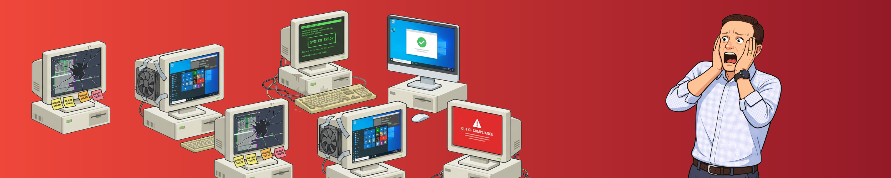
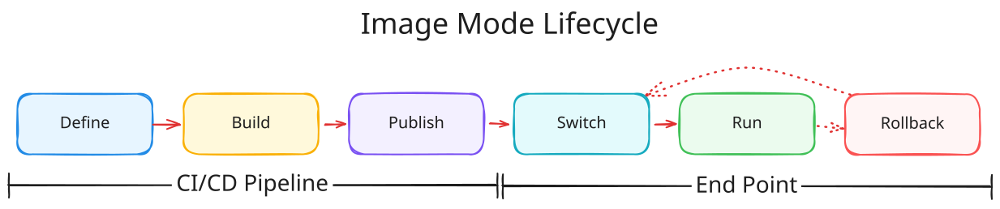
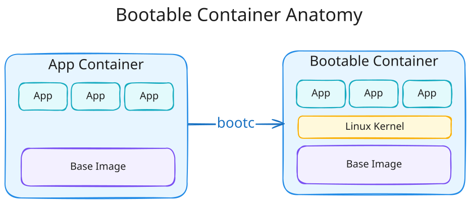
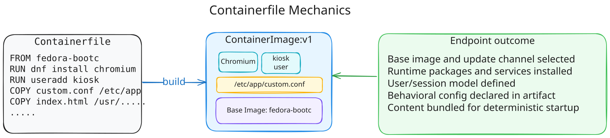
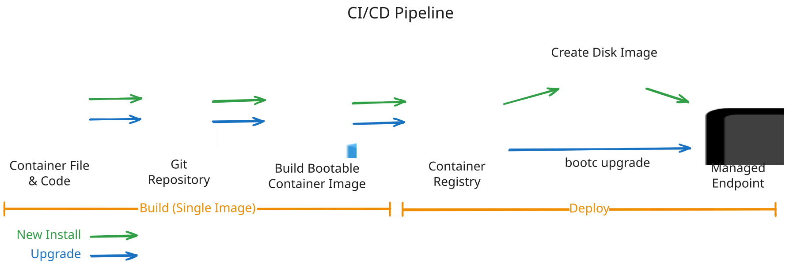
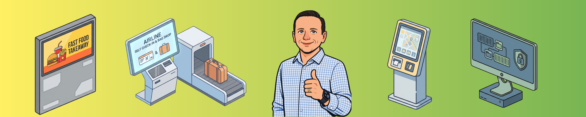

If you work in platform engineering, you've probably seen a split in maturity:

- Server and cloud platforms are moving toward immutable pipelines, versioned artifacts, and safer rollbacks.
- Endpoint SOE management is often still image once, patch forever, and hope the drift stays manageable.

That gap is where a lot of operational pain lives. Does this still need to be the case?

This post walks through __[image-mode-shenanigans](https://github.com/thomassmart/image-mode-shenanigans)__, a practical image-mode endpoint experiment. It is one implementation method, not the only one, exploring how we can bridge the technical gap between our herd of containers or servers and our collection of SOE pets. Bootable Containers (AKA Image Mode) clearly demonstrates the direction I believe controlled-purpose endpoints should move toward: immutable, atomic operating system delivery.

## In This Post


1. Why traditional SOE workflows become fragile at scale.
2. What bootable containers actually are.
3. How immutability and atomic upgrades change risk.
4. How `Containerfile` artifacts becomes the endpoint contract.
5. How build and deployment flow can work for you.
6. A practical install/upgrade/rollback runbook.
7. Where alternatives like VDI, MDM, and MicroOS-style models fit.

---

## The Problem: Endpoint Drift Becomes an Operations Tax



Traditional SOE processes are familiar:

1. Build a base image.
2. Deploy it.
3. Layer apps and policies over time and as required.
4. Patch in place indefinitely.
5. Rebuild when all too hard to resolve.

The issue is not that this never works. The issue is that this model scales uncertainty faster than it scales confidence.

### What breaks first

In real world fleets, the first break is rarely catastrophic. It is gradual divergence from what was agreed upon and tested months or years prior. Over time:

- one device group misses a dependency update
- one policy applies differently after an in-place patch
- one setting is tested to resolve an issue and left in place indefinitely
- multiple apps are deployed outside of the corporate marketplace
- one driver path behaves differently on the same "standard" build
- numerous files are stored outside of locations that are protected.

Now every incident starts with a forensic question: "what is this endpoint actually running?". This is where things start to become 'tricky'

### Why patch-forever models get expensive

When state is mostly changeable (i.e. mutable), cost silently shifts from imaging and delivery to issue investigation and resolution:

- troubleshooting takes longer because baseline truth is fuzzy
- support teams spend more time identifying the state of an endpoint
- rollout confidence drops, so patch velocity slows and increases in cost
- rollback becomes political because state history is unclear

This is the hidden endpoint tax: not one giant outage, but continuous low-grade operational drag. The operational support time grows with time, rather than scale.

### Real-world impact patterns

You can see this most clearly in controlled-purpose fleets:

- Quick-service endpoints that must update overnight without surprise behavior.
- Nurse stations displaying critical patient care information
- Digital signage where loss of playback impacts revenue
- Transport and kiosk terminals that have narrow maintenance windows.
- Airline self service kiosks that must meet regulatory and operational compliance.
- Warehouse/factory devices where uptime is required to maintain worker safety.

For these environments, predictability matters more than endpoint flexibility. That is exactly where immutable and atomic models pay off.

---

## One Practical Method: Image Mode with bootc

The __[image-mode-shenanigans](https://github.com/thomassmart/image-mode-shenanigans)__ repo packages a Fedora kiosk OS as a bootable artifact, ships it through CI, and installs via ISO/image-based flow.

Core lifecycle:



_Define -> Build -> Publish -> Switch -> Run -> Roll back if needed_

In this model, the endpoint is not a hand-tuned machine. It is a known, version controlled, artifact. There is **NO** more building at the edge. 

I'm looking 👀 squarely at you ```Build-Script.ps1``` and ```User-Login.ps1``` 

---

## What Is a Bootable Container?

When most people hear "container," they think app packaging for Kubernetes or single-process workloads. A bootable container applies the same artifact principles to host OS delivery.

In practice:

- The image defines OS payload and endpoint behavior.
- CI builds and versions that state.
- Devices move between versions intentionally, then reboot into the new deployment.

Lets let that sink in for a moment. Versioned and selected artifacts define the runtime OS. Upgrades are a reboot. Yes. A reboot. Those who manage large known purpose fleets rejoice. 👏



`bootc` is one way to implement this model. It bridges image-based artifacts with host boot/update behavior so endpoint lifecycle can be managed like other platform assets.

---

## Why Immutability and Atomicity Change the Risk Model


These terms are often used as slogans. They are most useful when treated as operational requirements, not desires.

### Immutability in practice

*Define Immutability: the state of not changing, or being unable to be changed*

Immutability means desired state comes from a built artifact, not from ad-hoc host mutation.

That does not mean change is impossible. It means change is meaningful and considered. Change flows through:

1. Source control
2. Build pipeline
3. Promoted image tag
4. Controlled rollout

Sounds pretty delicious. Am I right?

This gives teams clear understanding of endpoint state, artifact versions and cleaner incident triage.

### Atomic upgrades in practice

*Define Atomic: of or forming a single irreducible unit or component in a larger system*

Atomic upgrade means endpoint transitions happen as a single, coherent, version shift at boot boundary, not as long-running in-place mutation.

That reduces risk because it avoids mixed states where:

- part of the stack is updated
- part is still previous version
- rollback intent is clear but rollback path is not

Atomicity makes rollback practical because you are moving between known versions, not trying to reverse-engineer mutable live state with partial upgrades.

### What this means operationally

The direct benefits are practical:

- lower drift
- faster incident isolation
- safer promotion
- true comprehensive rollback capability

Real-world architecture can still vary. Some teams will use VDI, some MDM-first models, some transactional distro approaches. However, the target outcome should stay consistent: known state, controlled versions, and fast recovery.

---

## Why This Repo Is a Useful Example


Many organisations have adopted the atomic and immutable ideology, however this has primarily been achieved through process and procedure. This example project is useful because it is concrete, not theoretical, proof that this ideology can be achieved through technical means, using components such as:

- OS behavior is defined in `Containerfile`.
- CI builds and publishes `latest` plus commit SHA tags.
- Install media is generated with `bootc-image-builder`.
- Kiosk behavior is baked in.
- Break-glass access is injected at build/install stage via secrets.

It is enough to prove the operating model without pretending to be the only architecture.

---

## Containerfile: The Endpoint Contract

This is an important technical boundary in the whole flow. The `Containerfile` is not just packaging boilerplate. It is your endpoint contract. What you define, is what is. Want to add a package, run the relevant installer. Need a specific file, copy it from source.

From the repo:

```Dockerfile
FROM quay.io/fedora/fedora-bootc:latest

RUN dnf -y install \
      gdm \
      gnome-kiosk \
      gnome-kiosk-script-session \
      podman \
      chromium \
    && dnf clean all \
    && systemctl enable gdm \
    && systemctl set-default graphical.target

RUN useradd -m -d /var/home/kiosk -s /bin/bash kiosk
COPY config-files/gdm-custom.conf /etc/gdm/custom.conf
COPY config-files/kiosk-nginx.container /etc/containers/systemd/kiosk-nginx.container
COPY index.html /usr/share/kiosk-site/index.html
```

How to read this contract:

- `FROM` chooses base image.
- `RUN` defines runtime package and any scripts to executed.
- `COPY` places files within the container at the specified location.



**📜 If behavior is not declared in this build contract, it is not reliable platform state. 📜**

---

## Deployment Pipeline: Build, Publish, Promote

Once the contract exists, deployment should be artifact-first and boring. Yep, this has all been to exciting. Once the artifact has been created, versioned, tested and published. The rest should now be boring. 🥱

From `.github/workflows/image-build.yml`:

```yaml
- name: Build image with Podman
  run: |
    podman build \
      -t ghcr.io/${{ github.repository }}:latest \
      -t ghcr.io/${{ github.repository }}:${{ github.sha }} \
      .

- name: Push image to GitHub Container Registry
  uses: redhat-actions/push-to-registry@v2
  with:
    image: ${{ github.repository }}
    tags: latest ${{ github.sha }}
    registry: ghcr.io
```

Why this matters:

- `latest` is easy for operators.
- `sha` is precise for audit and rollback targeting.

The workflow also injects break-glass user config into ISO build customization:

```toml
[[customizations.user]]
name = "break-glass"
password = "${ESCAPED_PASSWORD}"
key = "${ESCAPED_KEY}"
groups = ["wheel"]
```

That keeps emergency access available without hardcoding static privileged credentials into base layers. This pipeline creates two key artifacts. A container image, published to a container registry, and an ISO. More on that later.




---

## Runbook: Install, Validate, Upgrade, Rollback

Architecture only is successful if day-2 operations benefits. Fortunately for the Architects interested, this is easily achieved with bootc.

### Install method A: Consume workflow-generated ISO
This should be the main method used when dealing with production workloads. Let the determined steps of the pipeline build the artifact.

1. Open latest successful workflow run.
2. Download `bootc-iso-<sha>` artifact.
3. Boot target VM/hardware from ISO.
4. Complete install and reboot.
5. Validate kiosk startup and break-glass access.

### Install method B: Build install media from published image

```bash
IMAGE_REF="ghcr.io/<owner>/<repo>:latest"
mkdir -p output
sudo podman pull "$IMAGE_REF"

sudo podman run --rm --privileged \
  --security-opt label=type:unconfined_t \
  -v "$(pwd)/output:/output" \
  -v /var/lib/containers/storage:/var/lib/containers/storage \
  quay.io/centos-bootc/bootc-image-builder:latest \
  --type anaconda-iso \
  --rootfs xfs \
  "$IMAGE_REF"
```

Use this method when you need local control over timing, validation windows, or artifact handling.

### Validate before promotion

Minimum checks before rollout:

- login/session startup behavior is correct
- kiosk app and dependencies start reliably
- network + content endpoint checks pass
- break-glass control path works as intended

### Upgrade flow

```bash
bootc switch ghcr.io/<owner>/<repo>:<new-tag>
reboot
```

Promote in rings: lab -> canary -> pilot -> broad.

### Rollback flow

```bash
bootc rollback
reboot
```

---

## Upgrade Timing and Risk Controls

So you've now mastered building the artifact. No doubt your realising the benefits of have your own endpoint contract! Don't stop here. In fact most programs fail here, not in the build stage, but because governance is now 'handled by the AI super pipeline'. People make mistakes. Don't forget the history, principles and patterns that gave you operational stability before technical immutability and atomicity.

Use clear lanes:

- Critical security: accelerated lane, tighter validation.
- Standard security/reliability: regular windowed cadence.
- Feature/UX changes: slower lane, wider pilot sampling.

Use predictable timing:

- weekly or bi-weekly maintenance windows
- emergency out-of-band lane
- monthly artifact housekeeping

Align windows with real operations:

- avoid mission-critical business periods
- coordinate support coverage before wave start
- define rollback authority before rollout begins

---

## Alternatives and Where They Fit


Image mode is one method, not the only one - I just happen to like it. Common alternatives remain valid, and should be evaluated against your own requirements:

- Traditional imaging + config management where existing ops maturity is high.
- VDI/DaaS where centralisation and fast session recovery dominate requirements.
- MDM-enforced baselines where policy and compliance control are primary.
- Transactional Linux endpoint variants (for example, SUSE MicroOS-style approaches) where minimised mutable host state is the priority.

Across these options, the strongest common pattern is still the same: reduce mutable state and improve deterministic recovery.

## Where Image Mode Fits Best



Good use cases:

- Kiosk/signage
- meeting-room/task terminals
- retail/frontline endpoints
- tightly scoped edge nodes

More 'challenging' use cases:

- highly personalised desktop fleets
- environments with constant local ad-hoc tooling variation
- use cases where mutable local state is an explicit requirement

Balanced view: this is a high-leverage pattern for the right endpoint class, not a universal answer.

---

## Final Thoughts


`image-mode-shenanigans` is useful demonstration because it turns architectural intent into testable operations:

- define behavior as code
- ship versioned artifacts
- deploy atomically
- recover by known rollback path

Many organisations with public facing, known workflow/purpose or mission critical endpoints should evaluate this concept.

If you want to evaluate this concept honestly, fork it and run it against your real constraints:

- [thomassmart/image-mode-shenanigans](https://github.com/thomassmart/image-mode-shenanigans)

If it survives your environmental requirements and constraints, you likely have a strong candidate pattern. Its a fun demonstration to perform an upgrade and rollback along side existing methods in your fleet.

Have at them!

---


