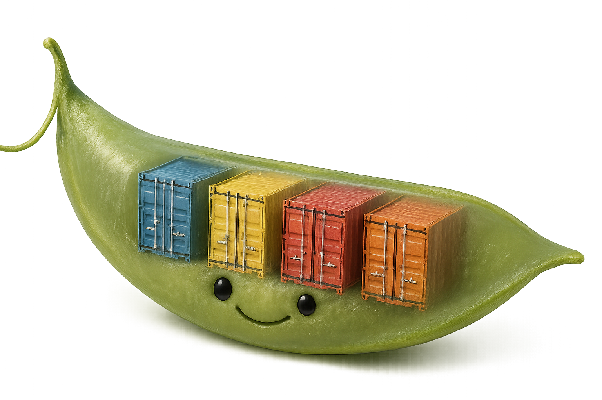
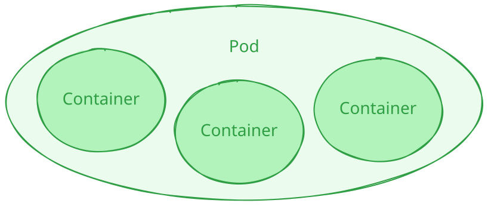
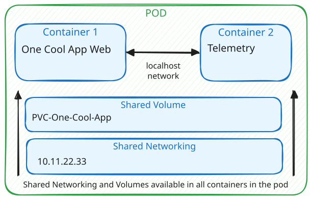
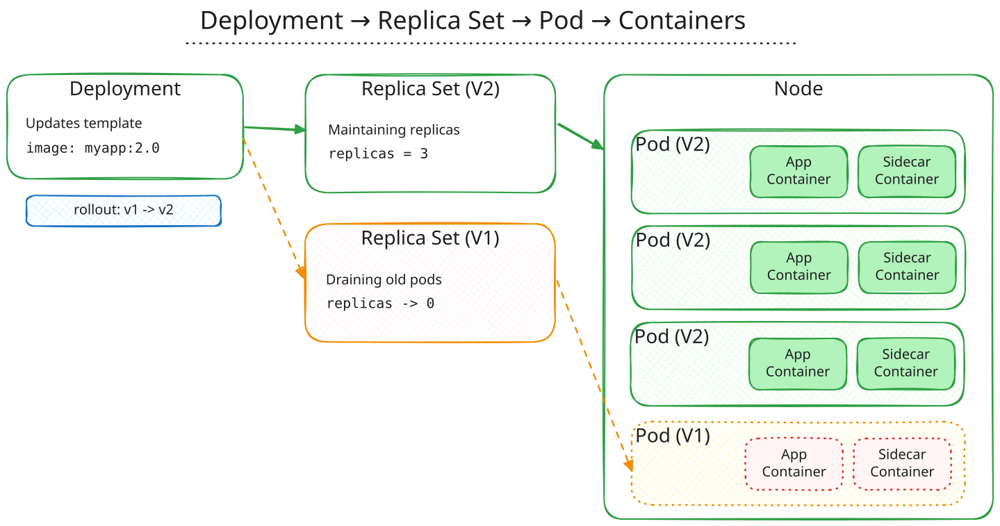

If you’ve spent time with containerised workloads, you’ve probably come across both **containers** and **pods** and maybe wondered why Kubernetes needs both. 

Aren’t containers enough on their own?  

What's a 'pod'? Why does there seem to be a never ending realm of complexity? 

**Why can't I ever find matching socks?**


In this post, we’ll break down what each actually does, how they work together, and why understanding the distinction matters when designing, deploying or supporting modern workloads.

---

## Background: Where Containers Fit 🚚

Containers are the basic **unit of software packaging and runtime isolation**.  

They bundle an application and all its dependencies into a portable image that runs the same way across environments. Whether that’s your laptop, a container running on a raspberry pi, or supporting global workloads in the cloud with 100's or 1000's of replicas!

Each container:

- Runs a single process (e.g., a web service, API, or background worker)  
- Shares the host’s kernel but has its own user space  
- Is isolated from other containers by namespaces and cgroups

In practice, this makes containers a great building block for microservices and scalable deployments. But containers alone don’t solve orchestration! Containers don't tackle things like scheduling, health checks, scaling, or networking between services.

✨ That’s where Kubernetes comes in. ✨

---

## Introducing 🫛 Pods — Kubernetes’ Scheduling Unit

A **Pod** is the smallest deployable object in Kubernetes — not a container replacement, but an abstraction *above* it.  

Think of a pod as a wrapper that defines **how one or MORE containers run together on the same node**.  



Each pod:

- Can contain one or more tightly coupled containers (e.g., an app container and a sidecar for logging)  
- Shares networking (one IP per pod) and storage volumes between those containers  
- Is treated by Kubernetes as a single scheduling unit

So, while containers provide process-level isolation, pods provide **deployment-level coordination**.



---

## Why Kubernetes Uses Pods

Kubernetes’ design deliberately separates *how containers run* from *how workloads are managed*.  

The **Pod** layer allows Kubernetes to:

1. **Group containers that must work together** — e.g., a web server + log shipper.  
2. **Attach metadata and policies** — resource limits, probes, service accounts to a collection of containers.  
3. **Handle networking consistently** — all containers in a pod share the same IP and port space.  
4. **Simplify scaling** — Kubernetes replicates pods (not individual containers) to handle load.

Without pods, orchestration would have to deal with each container directly — far more complex and less consistent.

---

## Example: A Simple Pod Definition

Here’s a quick YAML snippet showing how two containers can share the same pod:

```yaml
apiVersion: v1
kind: Pod
metadata:
  name: app-with-sidecar
spec:
  containers:
    - name: app
      image: myapp:latest
      ports:
        - containerPort: 8080
    - name: sidecar
      image: log-collector:latest
      volumeMounts:
        - name: logs
          mountPath: /var/log/app
  volumes:
    - name: logs
      emptyDir: {}
```

Both containers share the same IP, storage volume, and lifecycle. Kubernetes manages them as one logical unit.

---

## When to Think in Pods vs Containers

Here’s a simple way to frame it:

| Context | Think in terms of... | Why |
|---|---|---|
| Building and packaging your app | **Containers** | You define what runs and how it’s built. |
| Deploying, scaling, and networking workloads | **Pods** | Kubernetes manages pods, not containers directly. |
| Troubleshooting | **Pods first, then containers** | Pod events and status often explain container-level issues. |

In short: **containers run the app, pods run the containers.**

---

## Take-aways / Next Steps

Understanding pods and containers isn’t just Kubernetes trivia — it’s critical for designing resilient, observable workloads.  
When you’re architecting solutions, think of pods as the control boundary that keeps your containers coordinated and manageable.



---

## Further Reading

- Kubernetes Concepts — Pods: https://kubernetes.io/docs/concepts/workloads/pods/  
- Sidecar Pattern discussion: https://kubernetes.io/blog/2023/08/25/native-sidecar-containers/  
- Networking model overview: https://kubernetes.io/docs/concepts/cluster-administration/networking/

---

*If you’d like to chat about edge-hosted Kubernetes or containerised workloads in at the edge, feel free to reach out on LinkedIn.*

Thank you for reading.


