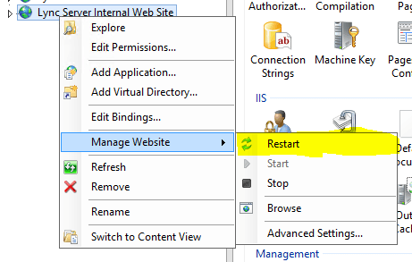

I was having issues with a desk phone (Specifically a Polycom VVX310 running 5.4.0.10182) signing in to Lync 2013 with Ext/Pin. When attempting auth the phone would simply return "Lync Sign in Failed". Pin Auth had been previously working and no changes to DNS or DHCP had been made and all certificates were valid.

I cranked up the logs on the device and still couldn't see any issues. It was grabbing the CA on boot and would contact Lync and get a webticket, however the following in the log raised an eyebrow.

~~~~~~~~~~~
 0202115811|tickt|*|00|m_validUntil [0]
 0202115811|tickt|*|00|m_validityDuration [0]
 0202115811|tickt|*|00|m_bCertExists [0]
 0202115811|tickt|*|00|m_bCertExpired [1]
 0202115811|tickt|*|00|m_eErrorCode [9]
~~~~~~~~~~~~~~

Doubting the HTTPS certificate on the certificate service, I opened and confirmed that it was still valid and trusted.

The next step was to test an alternate phone and an alternate site. Same issue. This points us back to the issue being Lync wide.

Luckily there are a few powershell cmdlets that we can use to test the web ticket service.

~~~~~~~~
Test-CSClientAuth
~~~~~~~~
 will allow us to test NTLM authentication against the web ticket service.
 <a href="https://technet.microsoft.com/en-us/library/gg398712(v=ocs.14).aspx"> TechNet article </a>

~~~~~~~~
Test-CSPhoneBootsrap
~~~~~~~~

 will allow us to test PIN/EXT auth against the web ticket service.
 <a href="https://technet.microsoft.com/en-us/library/gg412852.aspx">TechNet article </a>

When testing these directly from your lync server you will need to fill out -TargetFqdn and -TargetURI to avoid DHCP lookups/failure. You can alternatively install the module on a PC that has DHCP and test from there.

Typical usage and responses for these cmdlets:

~~~~~~~~~~~

PS> Test-CsClientAuth -UserSipAddress USER@SIPDOMAIN -TargetFqdn LYNCSERVER.DOMAIN
cmdlet Test-CsClientAuthentication at command pipeline position 1
Supply values for the following parameters:
UserCredential

Target Fqdn : LYNCSERVER.DOMAIN
Target Uri : https://LYNCSERVER.DOMAIN:443/CertProv/CertProvisioningService.svc
Result : Success
Latency : 00:00:00.6313045
Error Message :
Diagnosis :

PS> Test-CsPhoneBootstrap -UserSipAddress USER@DOMAIN -PhoneOrExt "EXT" -PIN "PIN" -TargetFqdn LYNCSERVER.DOMAIN -TargetUri "https://LYNCSERVER.DOMAIN:443/CertProv/CertProvisioningService.svc"

Target Fqdn : LYNCSERVER.DOMAIN
Target Uri : https://LYNCSERVER.DOMAIN:443/CertProv/CertProvisioningService.svc
Result : Failure
Latency : 00:00:00.0973450
Error Message : No response received for Web-Ticket service.
 Inner Exception:The HTTP request is unauthorized with client authentication scheme 'Basic'. The authentication header received from the
 server was 'Basic realm ="LYNC"'.
 Inner Exception:The remote server returned an error: (401) Unauthorized.

Diagnosis :
 Inner Diagnosis:Warning : 120 LYNCSERVER.DOMAIN "InvalidPin"
 X-Ms-diagnostics : 28003;source="LYNCSERVER.DOMAIN";reason="The pin is invalid.";faultcode="wsse:FailedAuthentication"
 X-MS-Server-Fqdn : LYNCSERVER.DOMAIN
 Strict-Transport-Security : max-age=31536000; includeSubDomains
 X-Content-Type-Options : nosniff
 Content-Length : 4897
 Cache-Control : private
 Content-Type : text/html; charset=utf-8
 Date : Thu, 02 Feb 2017 01:20:52 GMT
 Server : Microsoft-IIS/8.0
 WWW-Authenticate : Basic realm ="LYNC"
 X-Powered-By : ASP.NET

~~~~~~~~~~~

As you can see above, the reason reported back was invalid pin. In my case I wasn't getting a response from the web-ticket at all (Above shown as demonstration)

So the issue was with the web service not responding. I restarted the internal web service within IIS and tested again. This resolved the issue and users were able to use ext/pin sign in again.

