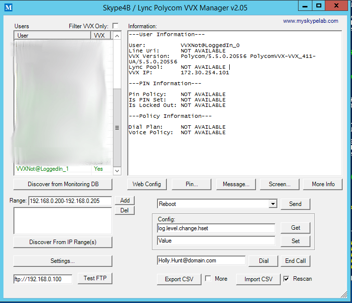

James Cussen has wrote an excellent script for managing Polycom VVX phones.

Its really intuitive and assist with management migrations from phone systems where endpoints and their IP addresses were easy to see (Think asterisk sip show peers). You can easily see all VVX phones that are in the monitoring DB as well as search subnets

This tool is absolutely legendary and can be downloaded from technet
[Here](https://gallery.technet.microsoft.com/Skype-for-Business-Lync-04884260")

James also has a really good write up [here](http://www.myskypelab.com/2015/10/skype-for-business-lync-polycom-vvx.html") outlining all the features and usage.
